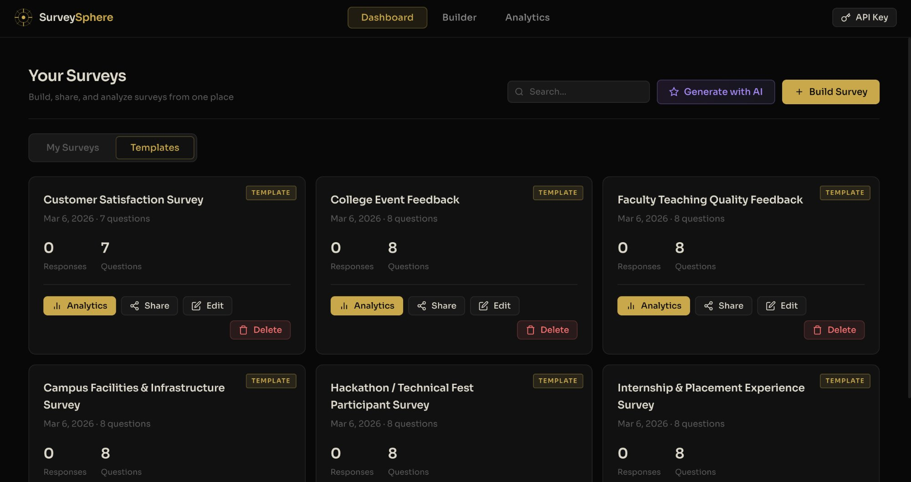
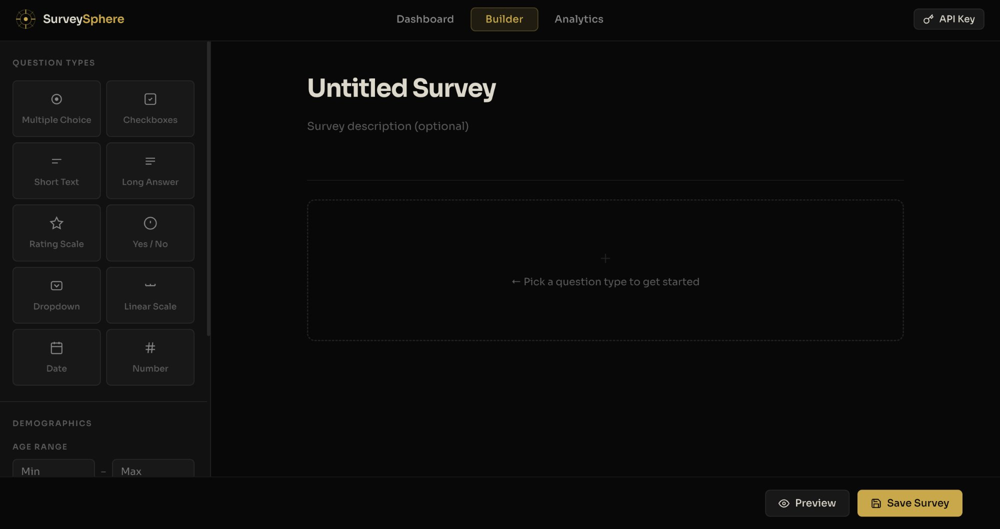
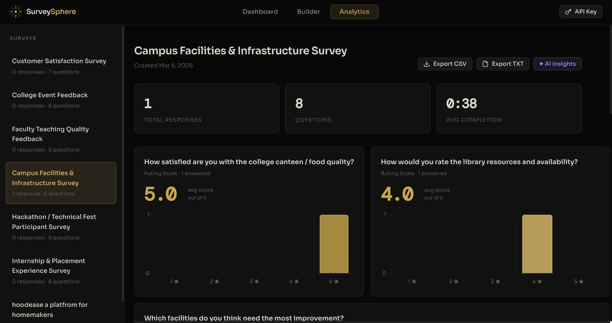
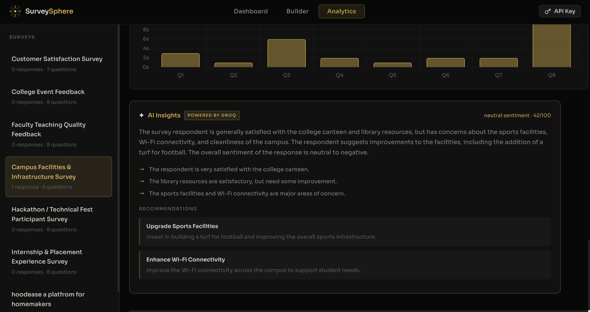

# 🌐 SurveySphere — AI-Powered Survey Intelligence Platform

> Build surveys. Collect responses. Understand them — with AI.

**[Live Site →](https://survey-sphere-mu.vercel.app/)**

---

## 💡 What is SurveySphere?

SurveySphere is a fully client-side survey platform with AI integration. No backend, no database, no sign-up required. Build a survey in minutes, share it via link, and get AI-powered insights from the responses.

Built with vanilla HTML, CSS, and JavaScript — deployed as a static site on Netlify.

---

## ✨ Features

- 🤖 **AI Survey Generation** — describe your survey in plain English, get a complete survey instantly (powered by Groq + Llama 3.3-70B)
- 📝 **10 Question Types** — Multiple Choice, Checkboxes, Short Text, Long Answer, Rating Scale, Yes/No, Dropdown, Linear Scale, Date, Number
- 🎯 **Demographic Eligibility Gate** — restrict surveys by age, gender, country, and occupation
- 📊 **Smart Analytics** — Chart.js visualisations with automatically chosen chart types per question
- 💬 **AI Insights** — sentiment analysis, key themes, and prioritised recommendations from response data
- 📥 **Export** — download responses as CSV or plain-text TXT
- ⏱️ **Time Tracking** — per-question and total completion time recorded per response
- 📋 **6 Built-in Templates** — pre-loaded college survey templates ready to share
- 🔗 **Share Links** — one-click shareable URL for any survey
- ⚡ **Zero Backend** — all data stored in `localStorage`

---

## 📸 Screenshots

**Dashboard — browse your surveys and templates**


**Builder — build surveys with 10 question types**


**Analytics — smart charts per question type**


**AI Insights — sentiment, themes & recommendations**


---

## 🤖 AI Features

AI generation and AI analysis require a free Groq API key.

1. Get a free key at [console.groq.com](https://console.groq.com)
2. Click the **API Key** button in the top-right corner of the app
3. Paste your key and click **Save & Verify**

The key is stored only in your browser's `localStorage` — it is never sent anywhere except directly to Groq.

---

## 📁 Project Structure

```
SurveySphere/
├── 📁 Documentations
│   └── 📕 AbdealiMakda_SurveySphere_CaseStudyReport.pdf
├── 📁 css
│   └── 🎨 style.css
├── 📁 js
│   ├── 📄 ai.js
│   ├── 📄 analytics.js
│   ├── 📄 app.js
│   ├── 📄 builder.js
│   ├── 📄 storage.js
│   └── 📄 survey.js
├── 📁 screenshots
│   ├── 🖼️ ai-insights.png
│   ├── 🖼️ analytics.png
│   ├── 🖼️ builder.png
│   └── 🖼️ dashboard.png
├── ⚙️ .gitignore
├── 📝 README.md
├── 📄 _redirects
├── 🌐 app.html
├── 🌐 landing.html
└── 🌐 survey.html
```

---

## 🛠️ Tech Stack

| Layer | Technology |
|---|---|
| Frontend | HTML5, CSS3 (Custom Properties), Vanilla JS (ES6+) |
| Charts | Chart.js 4.4.1 |
| AI Model | Meta Llama 3.3-70B Versatile |
| AI Provider | [Groq Cloud](https://groq.com) |
| Data Storage | Browser `localStorage` |
| Fonts | Sora + DM Mono (Google Fonts) |
| Deployment | Netlify |

---

## 🔄 How It Works

### Survey Flow
1. **Build** — add questions in the builder, or generate with AI
2. **Share** — copy the share link and send it to respondents
3. **Analyse** — view charts and AI insights in the analytics panel

### Data Storage
Everything is stored in three `localStorage` keys:
- `surveysphere_surveys` — all survey objects
- `surveysphere_responses` — all response data, keyed by survey ID
- `surveysphere_api_key` — your Groq API key

> ⚠️ Since data lives in the browser, each device/browser instance has its own isolated data. For shared persistent storage, a backend (Firebase, Supabase) would be needed.

---

## 📋 Built-in Templates

Six survey templates are pre-loaded for Indian college use cases:

- Customer Satisfaction Survey
- College Event Feedback
- Faculty Teaching Quality Feedback
- Campus Facilities & Infrastructure Survey
- Hackathon / Technical Fest Participant Survey
- Internship & Placement Experience Survey

---

## 🙏 Acknowledgements

- [Groq](https://groq.com) — ultra-fast LLM inference API
- [Meta AI](https://ai.meta.com) — Llama 3.3-70B model
- [Chart.js](https://www.chartjs.org) — canvas-based charting library
- [Google Fonts](https://fonts.google.com) — Sora & DM Mono typefaces

---

## 👨‍💻 Developer

**Abdeali Makda**
